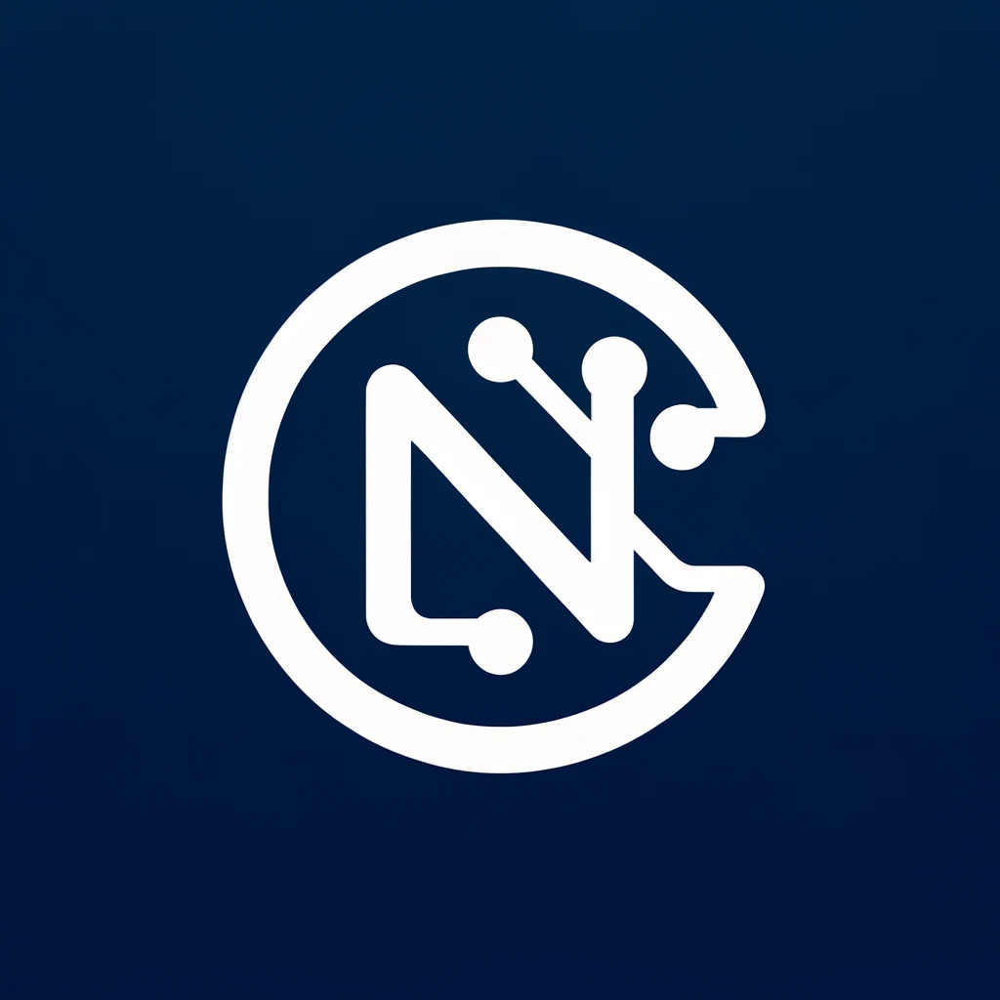

<p align="center">
  
</p>

# NeuralCasting

## Description

*Neural Casting* is a front-end compiler to convert ONNX format (*Open Neural Network Exchange*) to a specific programming language. Currently, conversion to C code is supported, but the software aims to provide an infrastructure suited to convert ONNX structure to different programming languages and intermediate representations. This makes *Neural Casting* a suitable entry point for backend compilers.
The core of *Neural Casting* is the use of the *Direct Acyclic Graph* (DAG) provided by ONNX structure to replace the *Abstract Syntax Tree* (AST) of the traditional compilers. As a result, the code generation is possible with an exploration algorithm of such data structure, considering the dependencies between the different operators of the encoded neural network.  

## Setup

For the setup of *Neural Casting*, use the following procedure:

1. Clone the repository:
```shell
git clone git@github.com:alecerio/NeuralCasting.git
cd NeuralCasting
```

2. Install the conda environment:

```shell
conda env create -f env.yml
```

You can find `env.yml` in the main page of the repository.

3. Activate the conda environment:

```shell
conda activate neural_casting
```

4. To install the compiler package in `neural_casting`, run the setup file:

```shell
python setup.py install
```

5. Install *gcc* in your system. For example, here is reported the installation for Ubuntu 22.04.

```shell
sudo apt update
sudo apt install gcc
gcc --version
```

5. In *config/config.yaml*, update the settings:

- *name*: the name of the project you want to build (for example, if name is *dummy* and you compile to C code, the generated files will be *dummy.c* and *dummy.h*).
- *repo*: the path where you cloned the repository (for example */home/repo/NeuralCasting/*).
- *workdir*: the work directory where you want to generate temporary and output files when you build the neural network (for example */home/my_workdir/*).

Inside the *workdir* directory, create two folders:
- temp_path
- output

## Usage

Currently, onnx and pytorch models are supported as input and C code as output. The entry point of the compiler is the function `run` in `neural_cast/compiler.py`.
You must pass as first parameter the configuration of the compiler (e.g. the one you can find in `config/config.yaml`), while the following parameters depend on the selected framework.

### PyTorch

If `framework='pytorch'`, then you have to specify the following parameters:
- `model`: an instance of the pytoch model.
- `dummy_input`: the dummy input for the model (check that the shape is compatible with the model).
- `params`: the weights of the model.

Example:

```python
import os
import yaml
import torch
from neural_cast.compiler import run

# load configuration
curr_file = os.path.abspath(__file__)
curr_path = os.path.dirname(curr_file)   
with open(curr_path + '/../../config/config.yaml', 'r') as yaml_file:
    config = yaml.safe_load(yaml_file)

# run compiler
run(config, framework='onnx', path=curr_path + '/model.onnx')

# check generated code in the output folder defined in config.yaml
```

### ONNX

If `framework='onnx'`, then you have to specify the following parameters:
- `path`: the path and the name of the onnx file (including the .onnx extension).

Example:

```python
import os
import yaml
import torch
from neural_cast.compiler import run

# load configuration
curr_file = os.path.abspath(__file__)
curr_path = os.path.dirname(curr_file)   
with open(curr_path + '/../../config/config.yaml', 'r') as yaml_file:
    config = yaml.safe_load(yaml_file)

# run compiler
run(config, framework='onnx', path=curr_path + '/model.onnx')

# check generated code in the output folder defined in config.yaml
```

## Tests

There are different tests implemented to ensure the generated code is correct. You can find the list of implemented tests in `tests/neural_networks/`:

- *constant*: test for ONNX constant operator.
- *conv*: test for ONNX convolution operator.
- *fc_add*: test for a neural network composed of a fully connected layer and an element-wise addition.
- *fc_mul*: test for a neural network composed of a fully connected layer and an element-wise multiplication.
- *fc_relu*: test for a neural network composed of a fully connected layer and a ReLu activation function.
- *fc_relu_fc_relu*: test for a neural network composed of a first fully connected layer, a first ReLu activation function, a second fully connected layer and a second ReLu activation function.
- *fc_sigmoid*: test for a neural network composed of a fully connected layer and a sigmoid activation function.
- *fc_softmax*: test for a neural network composed of a fully connected layer and a softmax activation function.
- *fc_sub*: test for a neural network composed of a fully connected layer and an element-wise subtraction.
- *fc_tanh*: test for a neural network composed of a fully connected layer and a tanh activation function.
- *flatten*: test for ONNX flatten operator.
- *gather*: test for ONNX gather operator.
- *global_averagepool*: test for ONNX global averagepool operator.
- *gru*: test for ONNX GRU operator.
- *matmul*: test for ONNX matmul operator.
- *maxpool*: test for ONNX maxpool operator.
- *reimplemented_gru*: test for a reimplementation of a GRU layer.
- *squeeze*: test for ONNX squeeze operator.
- *transpose*: test for ONNX transpose operator.

### Run the tests

Go the the repository directory:

```shell
cd /path/to/repository/
```

Ensure the compiler package is up to date:

```shell
python setup.py install
```

Run the tests:

```shell
python run_tests.py
``` 

## Open Works

The current main goal of the project is to run audio related neural networks on an STM32 board, specifically for de-noising.

Nevertheless, the project aims to provide a general infrastructure and to cover a wide range of use cases. Consequently, there are many oppurtunities of features integration in the future:

- Supporting a wider range of ONNX operators to support more use cases.
- Supporting the generation of other programming languages beyond C and intermediate representations (e.g. MLIR dialects).
- Implementation of optimizations and models compression techniques to the generated C code.
- Implementation of operator fusion techniques.

## Authors and Contacts

*NeuralCasting* is a project developed by [Alessandro Cerioli](https://dk.linkedin.com/in/alessandro-cerioli-26237231) during his Industrial PhD at [Jabra](https://www.jabra.dk/) and DTU ([Technical University of Denmark](https://www.dtu.dk/english/)) and is part of the European project [Convolve](https://convolve.eu/). For more information regarding the project or to actively contribute to the development of the repository, use the following contacts:

- **Jabra email**: alcerioli@jabra.com
- **DTU email**: alceri@dtu.dk

## License

This project is developed according to *apache 2* license (see *LICENSE*).