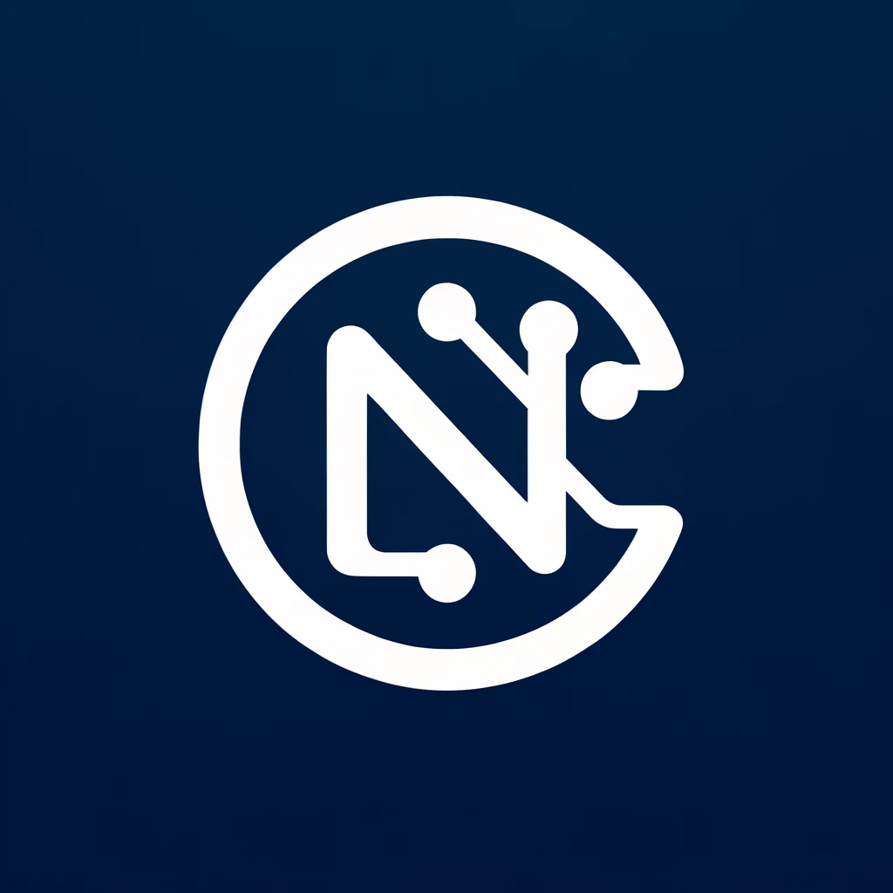

  

# NeuralCasting

## Description

The **NeuralCasting repository** provides a framework for converting neural network models from the ONNX format into efficient, standalone C code tailored for embedded systems. It includes support for the Patmos processor, a time-predictable architecture designed for real-time applications, enabling execution with predictable timing behavior.

The framework constructs an internal representation of the neural network and generates static C implementations of the supported operators, eliminating the need for heavyweight inference runtimes. It also offers quantization support (e.g., 8-bit and fixed-point arithmetic) to reduce memory usage and computational cost.

Overall, NeuralCasting is designed to deploy neural networks on resource-constrained and real-time systems, ensuring efficient execution and enabling worst-case execution time (WCET) analysis.

## Setup

## Tests

## Examples

## Open Works

## Authors and Contacts

*NeuralCasting* is a project developed by [Alessandro Cerioli](https://dk.linkedin.com/in/alessandro-cerioli-26237231) during his Industrial PhD at [Jabra](https://www.jabra.dk/) and DTU ([Technical University of Denmark](https://www.dtu.dk/english/)) and is part of the European project [Convolve](https://convolve.eu/). For more information regarding the project or to actively contribute to the development of the repository, use the following contacts:

- **Jabra email**: alcerioli@gn.com
- **DTU email**: alceri@dtu.dk

## License

This project is developed according to *apache 2* license (see *LICENSE*).